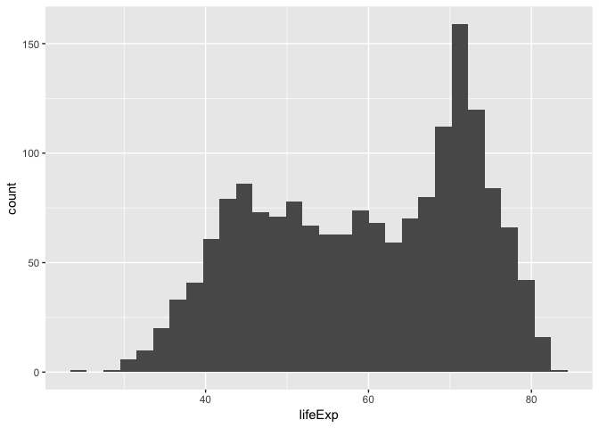
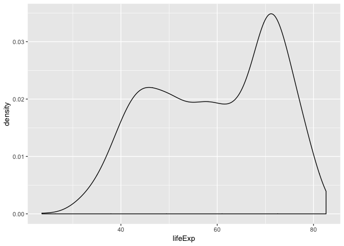
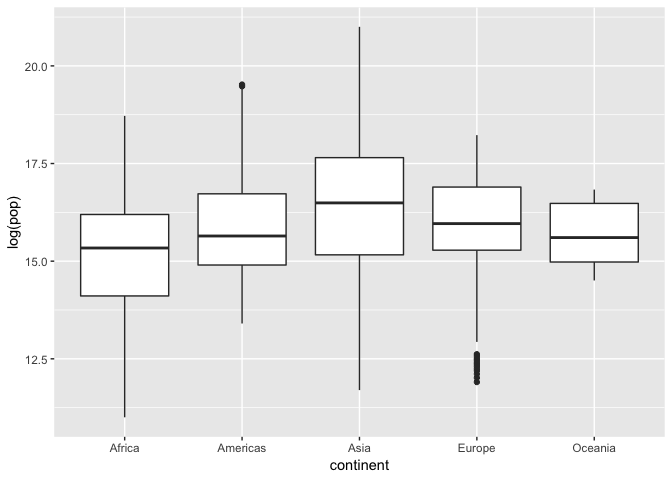
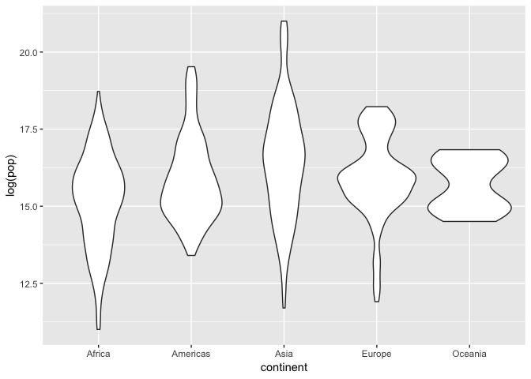
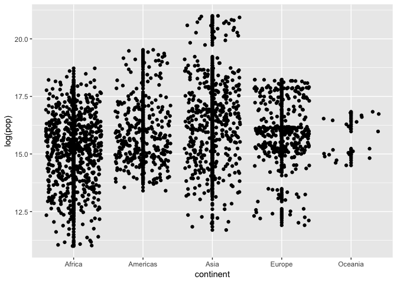
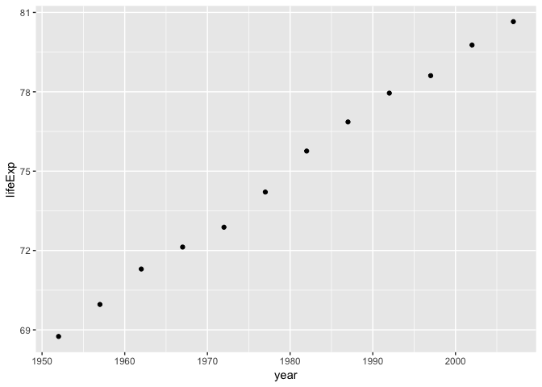
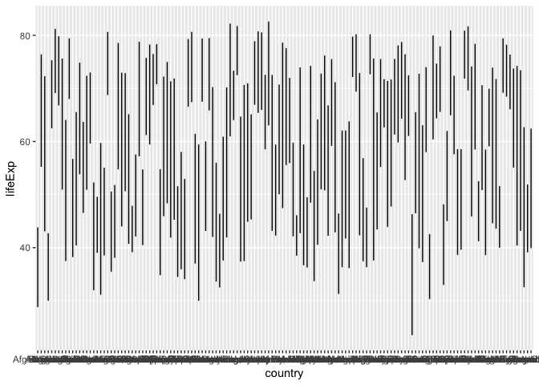
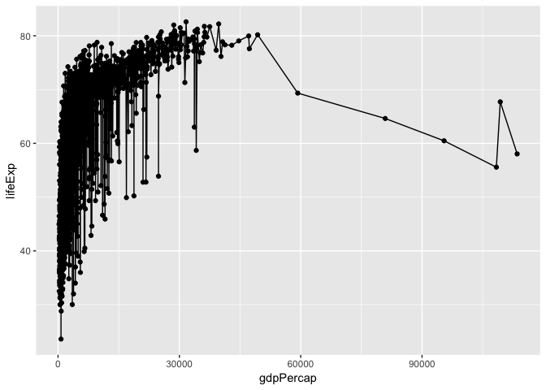
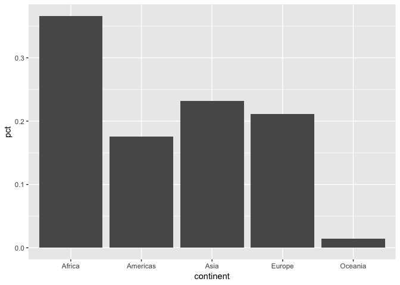

Cm006-exercise
================

``` r
library(tidyverse)
```

    ## ── Attaching packages ───────────────────────────────────── tidyverse 1.2.1 ──

    ## ✔ ggplot2 3.0.0     ✔ purrr   0.2.5
    ## ✔ tibble  1.4.2     ✔ dplyr   0.7.6
    ## ✔ tidyr   0.8.1     ✔ stringr 1.3.1
    ## ✔ readr   1.1.1     ✔ forcats 0.3.0

    ## ── Conflicts ──────────────────────────────────────── tidyverse_conflicts() ──
    ## ✖ dplyr::filter() masks stats::filter()
    ## ✖ dplyr::lag()    masks stats::lag()

``` r
library(gapminder)
library(scales)
```

    ## 
    ## Attaching package: 'scales'

    ## The following object is masked from 'package:purrr':
    ## 
    ##     discard

    ## The following object is masked from 'package:readr':
    ## 
    ##     col_factor

## scatterplot

``` r
ggplot(data=gapminder,aes(x=gdpPercap, y = lifeExp)) + geom_point()
```

<!-- -->

## histogram and density plot

``` r
ggplot(data=gapminder,aes(x=lifeExp)) + geom_histogram(bandwith=50) 
```

    ## Warning: Ignoring unknown parameters: bandwith

    ## `stat_bin()` using `bins = 30`. Pick better value with `binwidth`.

<!-- -->

``` r
ggplot(data=gapminder,aes(x=lifeExp)) + geom_density() 
```

<!-- -->

## box and violin

``` r
ggplot(data=gapminder,aes(x=continent,y=log(pop)))+geom_boxplot()
```

<!-- -->

``` r
ggplot(data=gapminder,aes(x=continent,y=log(pop)))+geom_violin()
```

<!-- -->

## jitter plot

``` r
ggplot(data=gapminder,aes(x=continent,y=log(pop)))+
  geom_point()+
   geom_jitter()
```

<!-- -->

## time/line plot

``` r
filter(gapminder,country=="Canada") %>%
  ggplot(aes(x=year,y=lifeExp))+geom_point()
```

<!-- -->

``` r
ggplot(gapminder,aes(x=country,y=lifeExp))+geom_line()
```

<!-- -->

## path plot

``` r
ggplot(gapminder,aes(x=gdpPercap,y=lifeExp))+geom_point()+geom_line()
```

<!-- -->

## Bar plot

``` r
f<-filter(gapminder,year==2007)%>%group_by(continent)%>%
    summarise(count=n())%>%mutate(pct=count/sum(count))
ggplot(f,aes(x=continent,y=pct))+geom_bar(stat="identity")
```

<!-- -->
