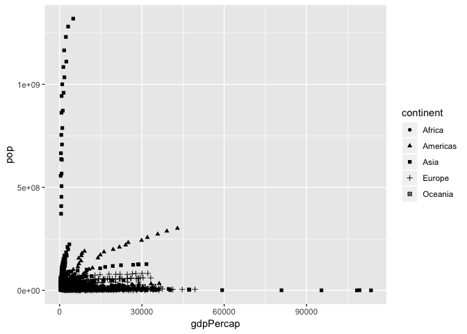
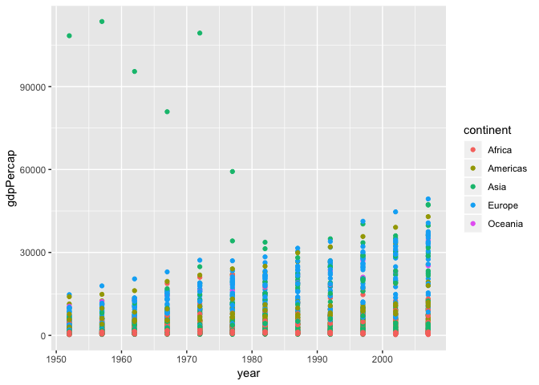
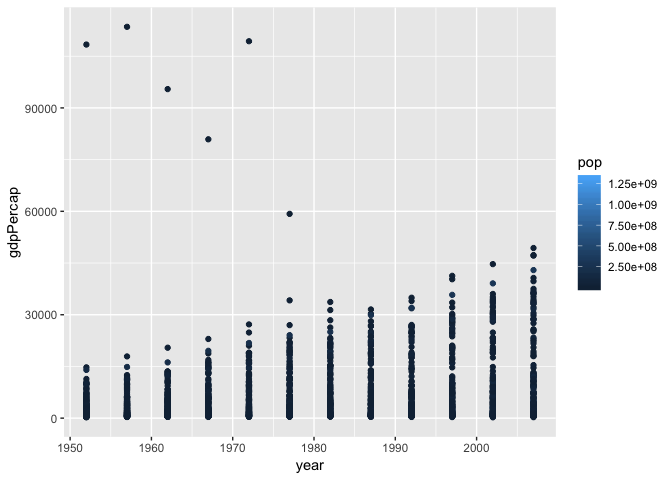
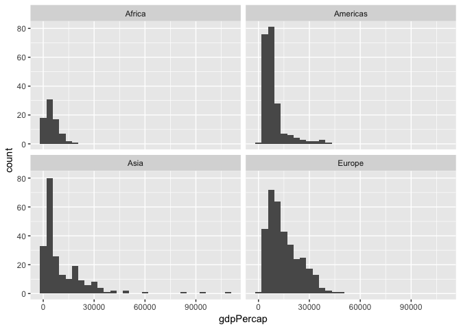
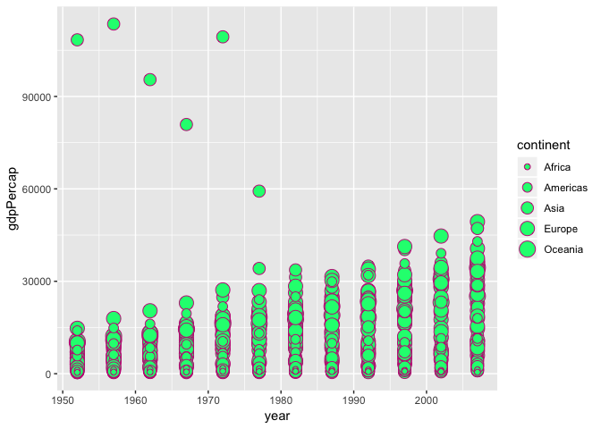
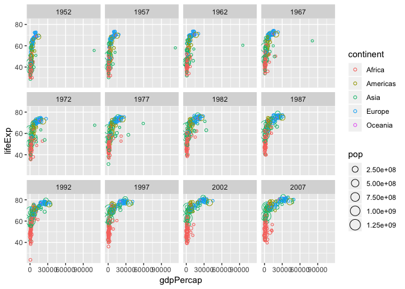
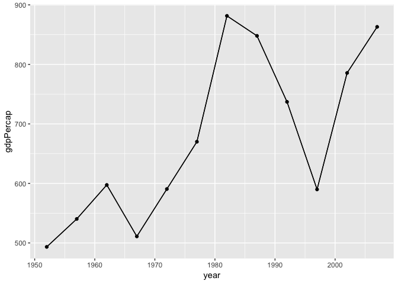

Cm007-exercise
================

``` r
library(gapminder)
library(tidyverse)
```

    ## ── Attaching packages ───────────────────────────────────── tidyverse 1.2.1 ──

    ## ✔ ggplot2 3.0.0     ✔ purrr   0.2.5
    ## ✔ tibble  1.4.2     ✔ dplyr   0.7.6
    ## ✔ tidyr   0.8.1     ✔ stringr 1.3.1
    ## ✔ readr   1.1.1     ✔ forcats 0.3.0

    ## ── Conflicts ──────────────────────────────────────── tidyverse_conflicts() ──
    ## ✖ dplyr::filter() masks stats::filter()
    ## ✖ dplyr::lag()    masks stats::lag()

## shape

``` r
ggplot(gapminder,aes(x=gdpPercap, y=pop))+geom_point(aes(shape=continent))
```

<!-- -->

## color

``` r
ggplot(gapminder,aes(x=year,y=gdpPercap))+geom_point(aes(color=continent))
```

<!-- -->

``` r
ggplot(gapminder,aes(x=year,y=gdpPercap))+geom_point(aes(color=pop))
```

<!-- -->

## facetting

``` r
filter(gapminder, lifeExp>60, !(continent=="Oceania"))%>%
  ggplot(aes(x=gdpPercap))+geom_histogram()+facet_wrap(~continent)
```

    ## `stat_bin()` using `bins = 30`. Pick better value with `binwidth`.

<!-- -->

## Bubble Plot

``` r
ggplot(gapminder,aes(x=year,y=gdpPercap,size=continent))+
  geom_point(shape=21,colour = "mediumvioletred",fill = "springgreen")
```

    ## Warning: Using size for a discrete variable is not advised.

<!-- -->

## Complete Plot

``` r
ggplot(gapminder, aes(x=gdpPercap, y=lifeExp, size=pop, color=continent))+
  geom_point(shape=21)+facet_wrap(~year)
```

<!-- -->

## path plot

``` r
filter(gapminder, country=="Rwanda")%>%
  ggplot(aes(x=year, y=gdpPercap))+geom_path()+
  geom_point()+geom_line()
```

<!-- -->
